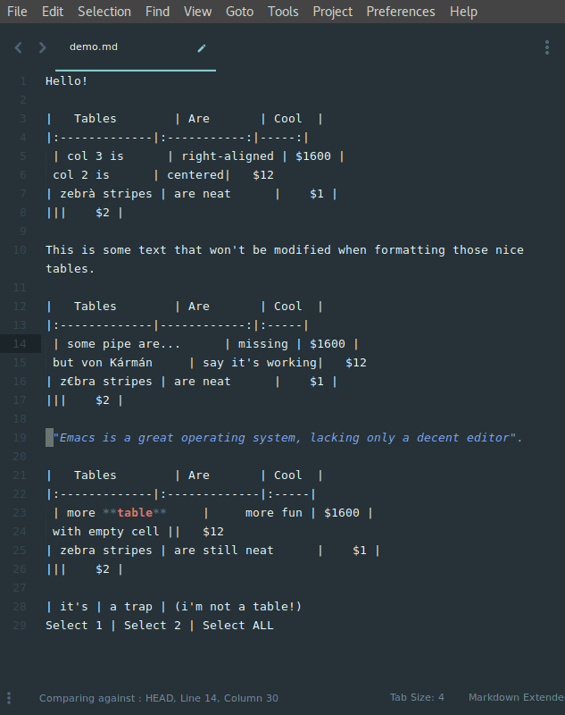

# Markdown Table Formatter

Sublime Text 3 markdown plugin that offers table formatting.

Based on https://atom.io/packages/markdown-table-formatter from **fcrespo82** (Fernando).



## Usage

There are two basic ways of using this plugin.  
  
1. Select the table you want to format and them hit ctrl+alt-shift-T to format it.  
2. If you didn't select any table, the entire document will be scanned for tables and formatted.  

## Configuration

```json
{
	// make plugin verbose in debug console
	"verbose": false,

	// scan document to format tables when saving
	"autoformat_on_save": false,

	// spaces between "|" and cell's text
	"margin": 1,

	// additional spaces before/after cell's text (depending on justification)
	"padding": 0,

	// how text should be justified when not specified [LEFT, RIGHT, CENTER]
	"default_justification": "LEFT"
}
```
